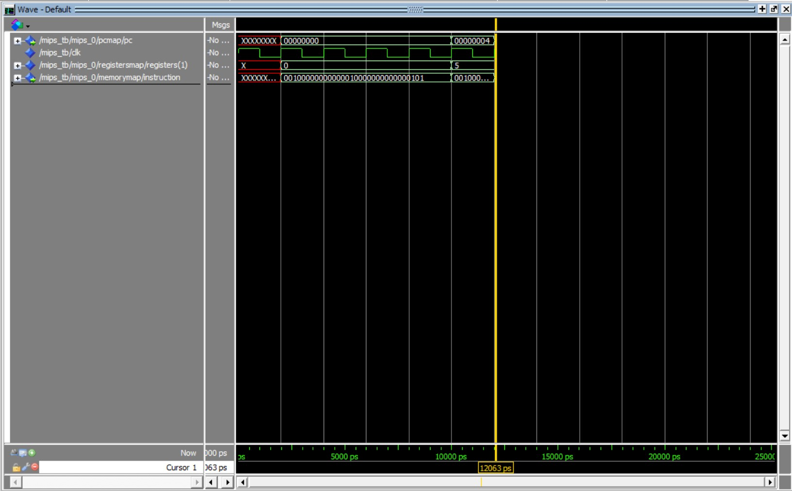
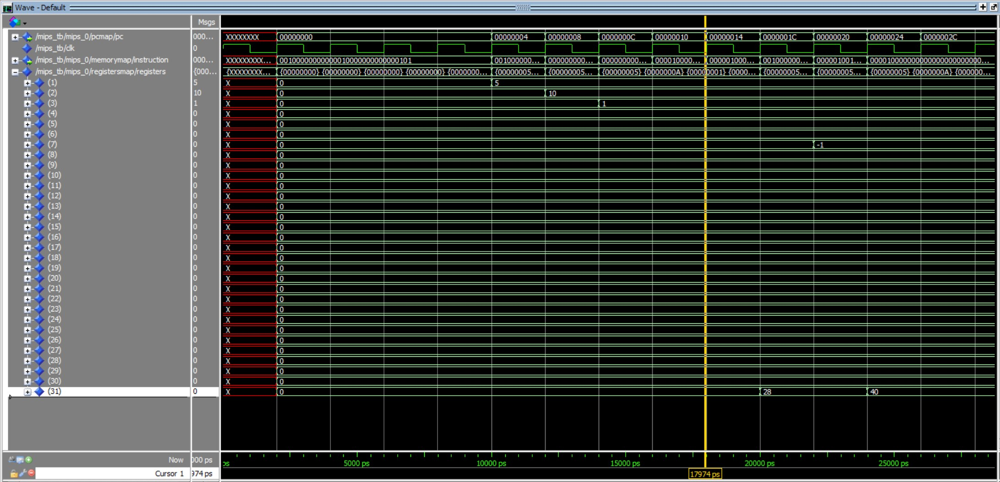

# MIPS-CPU

This repository contains VHDL code for simulating a MIPS processor. Most of the functions I wrote myself but the template with a little modelsim instruction was given to me by the Computer Orginaztion Lab at Delft University of Technology. As hobby project I included more instructions.

## Implemented Instructions 

* 000000 -- add, addu, and, nor, or, sll, srl, sub, subu, xor, jr, slt
* 000001 -- bgez, bltz, bgezal
* 000010 -- j
* 000100 -- beq
* 000101 -- bne
* 000110 -- blez
* 000111 -- bgtz
* 001000 -- addi
* 001001 -- addiu
* 001100 -- andi
* 001101 -- ori
* 001110 -- xori
* 001111 -- lui
* 100011 -- lw
* 101011 -- sw

## Simple Example

addi:
```
    ram (  0) <= "00000101"; -- addi $1,$0,5
    ram (  1) <= "00000000";
    ram (  2) <= "00000001";
    ram (  3) <= "00100000";
```



## Full Example
Program stored in memory.vhdl with manually created assembly code. I think there are linux tools available to create a vhdl memory file from a assembly language, unfortunately the one I used was propriatery. See for example test.s and test.vhdl. You can simply rename the file to memory.vhdl and run it within my toplevel VHDL files.

* addi $1,$0,5
* addi $2,$0,10
* slt $3,$1,$2
* slt $4,$2,$1
* j B
* bgezal $3,C
* addi $5,$0,0
* addi $7,$0,-1
* bgezal $7,D
* j Z
* addi $6,$0,1
* j Z



